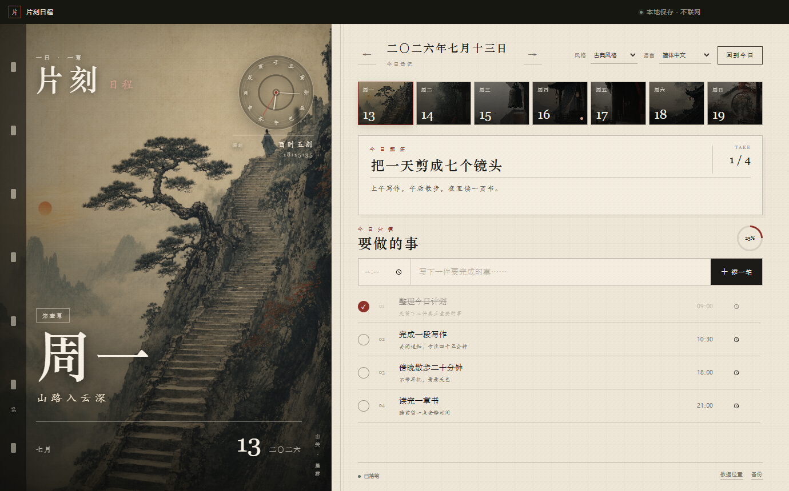
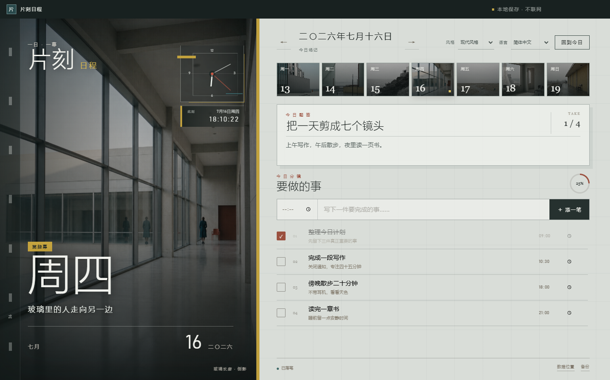

# 片刻日程

一款完全离线、带有电影美学的 Windows 日程软件。它把一周七天设计成七幕不同的场景，让每日计划像一份正在展开的电影场记。

## 界面预览

### 古典风格

山水、孤松、长阶与行者构成每日场景，配合楷宋字体、纸色界面和十二时辰古钟。



### 现代风格

现代建筑、玻璃、空旷空间与微小人物构成另一套七日画面，界面同步切换为冷灰配色、几何字体和建筑式时钟。



> 截图中的标题和事项均为虚构演示内容，不包含开发者或使用者的真实日程。

## 功能

- 完全本地运行，不要求注册账号，不访问网络。
- 内置“古典风格”与“现代风格”，主题选择会保存在本机。
- 古典风格使用七幅原创武侠电影画面、楷宋字体、宣纸配色和十二地支古钟。
- 现代风格使用七幅原创现代主义电影画面、几何无衬线字体、冷灰矿物配色和方形现代钟。
- 支持题签、旁白、事项时间、备注、完成状态和每日进度。
- 两套时钟均显示实时时间；古典主题同时保留传统时辰读法。
- 支持简体中文、繁體中文、English、日本語、한국어、Español、Français、Deutsch、Português、Русский、العربية和हिन्दी。
- 支持 JSON 数据备份，日程数据不会保存在源码目录中。

## 下载（普通用户）

目前正式支持 Windows 10/11（64 位），不需要安装 Node.js，也不需要下载源码。

1. 打开仓库右侧的 **Releases**。
2. 进入最新版本，在 **Assets** 中下载 `片刻日程-*-便携版.exe`。
3. 把 EXE 放在任意文件夹，双击即可运行；它是便携版，不需要安装。

Windows 首次打开未签名的开源软件时，可能显示安全提示。请确认文件来自本仓库的 Releases 页面后再运行。

## 使用方法

### 1. 选择日期

顶部七张缩略图对应一周七天。点击任意一天即可查看和编辑当天日程，也可以使用日期两侧的箭头切换前后一天；“回到今日”会立即返回当天。

### 2. 写下当天主题

在“今日题签”中给当天取一个标题，在下方旁白框记录一句提醒、感受或当天目标。输入框失去焦点后，内容会自动保存在本机。

### 3. 添加和完成事项

在“要做的事”下方选择时间、输入事项，然后点击“添一笔”。事项加入后可以：

- 点击左侧圆点标记完成或恢复未完成；
- 直接修改事项标题、备注和时间；
- 点击右侧删除按钮移除事项；
- 通过进度圆环查看当天完成比例。

### 4. 切换风格与语言

右上角的“风格”菜单可以在古典风格和现代风格之间切换。七日图片、字体、界面颜色和时钟会一起改变，选择会保存在本机。

“语言”菜单支持十二种常用语言，切换后日期、按钮、提示和主题文字会同步更新。

### 5. 查看和备份数据

软件右下角提供两个数据功能：

- **数据位置**：打开本机日程数据所在文件夹；
- **备份**：把全部日程导出成一个 JSON 文件，方便自行保存。

日程数据只保存在使用者自己的电脑上，不会上传到本项目或任何服务器。

## 快捷键

- `Ctrl + N`：快速定位到新事项输入框。
- `Alt + ← / →`：切换前一天或后一天。

## 从源码运行

请先安装 Node.js 与 npm，然后在项目目录中运行：

```powershell
npm install
npm start
```

运行自动测试：

```powershell
npm test
```

构建 Windows 便携版：

```powershell
npm run dist
```

构建结果会生成在本地的 `release` 目录中；该目录不会提交到源码仓库。

## 数据与隐私

软件通过 Electron 的系统应用数据目录保存 `planner-data.json`。点击软件右下角的“数据位置”可以直接查看文件所在位置。

- 软件没有网络请求功能。
- 源码仓库不包含个人日程数据。
- 删除程序不会主动删除已保存的日程数据。
- 建议定期使用软件中的“备份”功能导出 JSON 文件。

更完整的说明请参阅 [隐私说明](PRIVACY.md)。仓库默认忽略所有日程 JSON、EXE、构建产物和本地缓存。

## 项目结构

```text
app/          界面、样式、多语言和交互逻辑
assets/days/          古典风格的一周七日画面
assets/themes/modern/ 现代风格的一周七日画面
build/        Windows 应用图标
tests/        本地数据与多语言测试
main.js       Electron 主进程
data-store.js 本地日程数据存储
```

## 参与贡献

欢迎提交 Issue、改进翻译或提出界面与功能建议。提交代码前请先运行 `npm test`，并确保没有把个人日程、备份文件或构建产物加入提交。

## 许可证

本项目使用 [MIT License](LICENSE)。版权所有 © 2026 Mark LAO。
